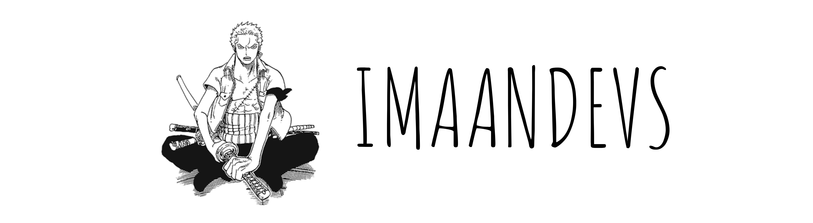

<h2 align="left">Hi, I'm Ayub 👋🏾</h2>
<h3 align="left">A passionate software developer from London 📍🇬🇧</h3>

<h4 align="left">About me:</h4>

I'm a 14-year-old software engineer diving into the world of front-end development. Computers have fascinated me since childhood, and now, I'm turning that fascination into innovation.

- 🔭 I’m currently working on **front-end development**
- 🌱 I’m currently learning **HTML & CSS**
- 📫 How to reach me: 
 **Instagram:** <a href="https://instagram.com/imaandevs" target="_blank">imaandevs</a> 
 **LinkedIn:** <a href="https://www.linkedin.com/in/imaandevs/" target="_blank">imaandevs</a> 

<h4 align="left">Languages and Tools:</h4>

 
     
     

<picture>
  <source
    srcset="https://github-readme-stats.vercel.app/api?username=imaandevs&show_icons=true&theme=dark"
    media="(prefers-color-scheme: dark)"
  />
  <source
    srcset="https://github-readme-stats.vercel.app/api?username=imaandevs&show_icons=true"
    media="(prefers-color-scheme: light), (prefers-color-scheme: no-preference)"
  />
  
</picture>
